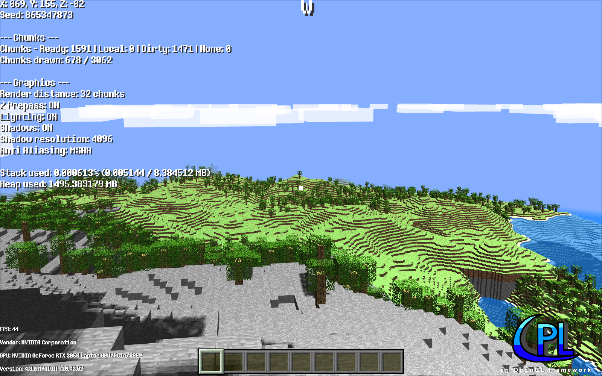
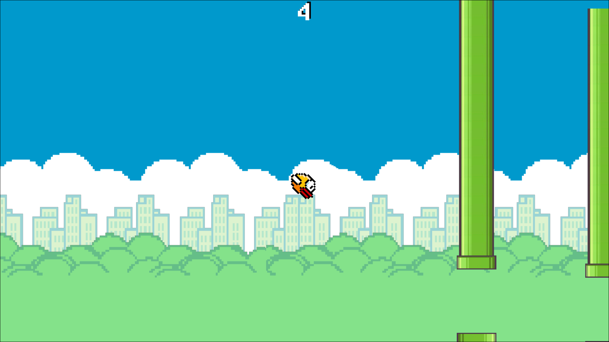
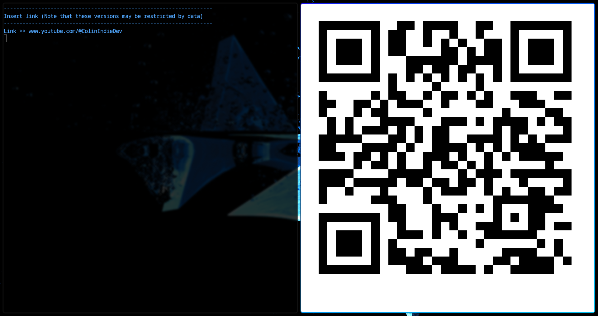
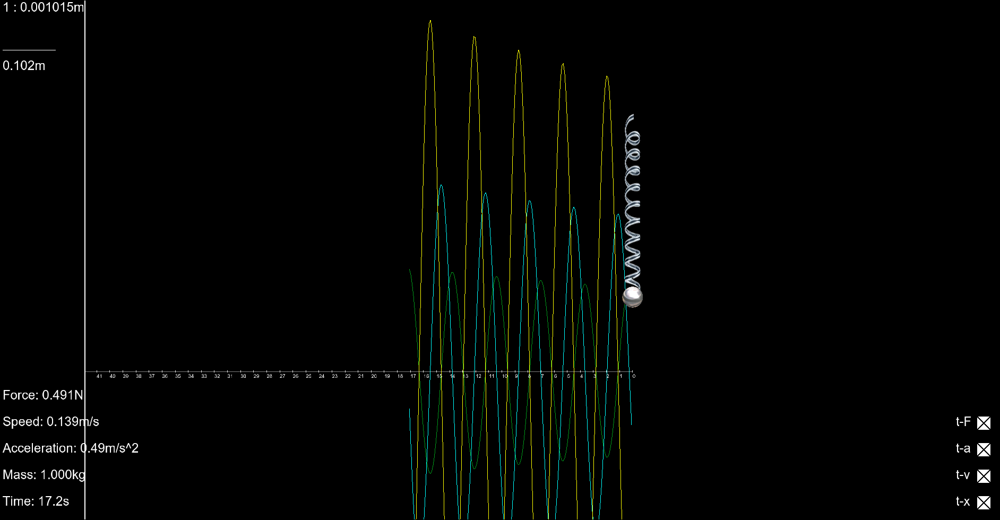
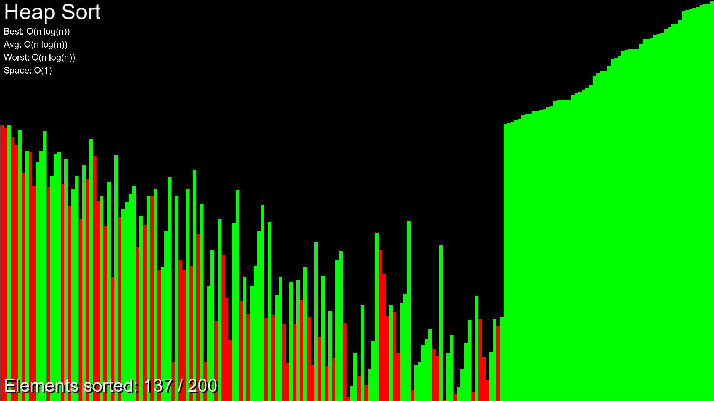
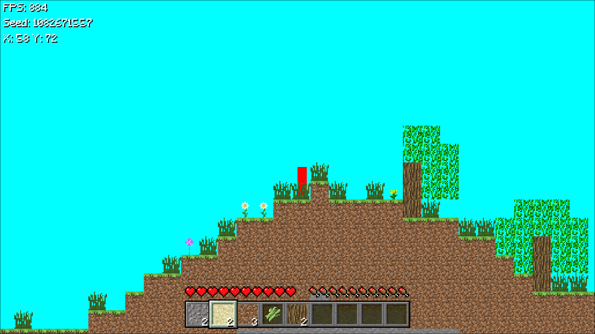

# CPLibrary (CPL)

## About
CPL (named by me) is my custom framework made from scratch. This framework was entirely written \
in C++ 17 and uses OpenGL & other low-level libraries like GLFW, GLAD, STBImage etc. \
Now this version should be rewritten in C(99). Currently I worked on this just for around few months, the C++ version
since september 2025.

## Example code
```c
//
// main.c
// 

#define CPL_IMPLEMENTATION
#include <cpl/cpl.h>

int main() {
    init_window(800, 600, "Welcome to CPL", OPENGL_VER_3_3);

    font default_font;
    create_font(&default_font, "fonts/default.ttf", "default", FILTER_NEAREST);

    while (!window_should_close()) {
        update();

        clear_background(BLACK);
        
        begin_draw(SHAPE_2D_UNLIT, false);

        draw_rect(VEC2F(0, 0), VEC2F(100, 100), RED, 0.0f);

        begin_draw(TEXT, false);
        draw_text(&default_font, "Hello OpenGL!", VEC2F(get_screen_width() / 2.0f,get_screen_height() / 2.0f), 1.0f, WHITE);

        end_frame();
    }

    close_window();
}
```

As you can see, the functions and structures are pretty similar \
and inspired by the ones from Raylib

## Games/Projects where I used CPL
It is not much yet but these are the projects and their link to GitHub:

### C++ (17)
> [!IMPORTANT]
> All these project may use an older version of CPL so do not get confused by that

- [Flappy Bird Clone](https://github.com/ColinIndieDev/Flappy-Bird-Clone)
- [Digit Recognition AI](https://github.com/ColinIndieDev/Digit-Recognition-AI)
- [Minecraft Clone](https://github.com/ColinIndieDev/Minecraft)
- [Ghost Buster](https://github.com/ColinIndieDev/Ghost-Buster)
- [CPAI](https://github.com/ColinIndieDev/CPAI)

Here is an impression of my first 3D game using my library:


### C (99)

In the CP-Headers repo are all projects I made with C in this version of CPL (most inside `src/` or separate repos):

- Flappy Bird Clone
  



- QR Code Gen
  



- Pendulum
  



- Sort Visualization
  



- [Minecraft 2D](https://github.com/ColinIndieDev/Minecraft-2D-in-C)
  



In the future, I will make other projects using my library and keep extending it as well!

## Functionality
The C version of CPL currently only supports 2D\
Since CPL is written in C & C++ and open source, you may look up the code \
and modify it potentially for personal use. Besides of making games
for Desktop (Windows & Linux), the framework + the code can be converted \
to Web with Emscripten (C++ version only for now).

2D:
- Primitives (Lines, Rectangles, Circles etc.)
- Text + Font
- 2D Lighting
- Texture
- Tilemap
- Particle System
- Gamma Correction
- HDR

Both:
- Camera
  
Others:
- Key & Mouse Inputs
- Audio
- Screenshot

## Used libraries
- GLAD
> Provides OpenGL functions

- GLFW
> Window and Input

- STB Image
> Textures

- Freetype
> Text & Fonts

- Miniaudio
> Audio (Sounds & Music)

## Building / Setup CPL 

Since the CPL in C is header only, you can just get the cpl.h and include it anywhere.
Only notice that you need the `shaders/` folder for fragment & vertex shaders + link all dependencies
yourself (see Used libraries which dependencies exist).
